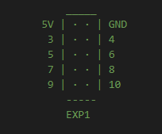

# FYSETC Mini 12864 Panel

FYSETC Mini 12864 Panel EXP1 and EXP2:


TH3D EZBoard EXP1:



TH3D EZBoard only supports CR10_STOCKDISPLAY,If you want to support FYSETC Mini 12864 Panel, you need to carry out the flying line operation, so you need to prepare 10 Dupont lines, the connection operation is as follows:

| FYSETC Mini 12864 Panel EXP1 and EXP2 | TH3D EZBoard EXP1 |
| ------------------------------------- | ----------------- |
| 5V                                    | 1                 |
| GND                                   | 2                 |
| LCD_CS                                | 3                 |
| LCD_A0                                | 4                 |
| MOSI                                  | 5                 |
| EN2                                   | 6                 |
| LCD_RST                               | 7                 |
| EN1                                   | 8                 |
| ENC                                   | 9                 |
| SCK                                   | 10                |

## Firmware config

This firmware is only used to test mini12864, if you want to support on the latest Marlin firmware, you need to configure the following

##### Step1. changes the pins.

On a TH3D_EZBOARD board, you need to make the following changes in pins_TH3D_EZBOARD.h:

```cpp tab='pins_TH3D_EZBOARD.h'
// #if ENABLED(CR10_STOCKDISPLAY)
//   #define BEEPER_PIN                       P1_31
//   #define BTN_EN1                          P3_26
//   #define BTN_EN2                          P3_25
//   #define BTN_ENC                          P1_30
//   #define LCD_PINS_RS                      P0_16
//   #define LCD_PINS_ENABLE                  P0_18
//   #define LCD_PINS_D4                      P0_15
//   #define KILL_PIN                         P2_11
// #elif HAS_SPI_LCD
//   #error "Only the CR10_STOCKDISPLAY is supported with TH3D EZBoard."
// #endif

#if ENABLED(CR10_STOCKDISPLAY)
  #define BEEPER_PIN                       P1_31
  #define BTN_EN1                          P3_26
  #define BTN_EN2                          P3_25
  #define BTN_ENC                          P1_30
  #define LCD_PINS_RS                      P0_16
  #define LCD_PINS_ENABLE                  P0_18
  #define LCD_PINS_D4                      P0_15
  #define KILL_PIN                         P2_11
#elif ENABLED(FYSETC_MINI_12864)

  #define BTN_EN1                         P3_26
  #define BTN_EN2                         P3_25
  #define BTN_ENC                         P1_30

  #define DOGLCD_CS                       P0_18
  #define DOGLCD_A0                       P0_16
  #define DOGLCD_SCK                      P1_31
  #define DOGLCD_MOSI                     P0_15
  #define LCD_PINS_ENABLE                 P0_18
  #define LCD_PINS_RS                     P0_16

  #define FORCE_SOFT_SPI

  #define LCD_RESET_PIN                   P2_11

#elif HAS_SPI_LCD
  #error "Only the CR10_STOCKDISPLAY is supported with TH3D EZBoard."
#endif
```

##### Step2. Config the configuration.h.

Because the TH3D_EZBOARD board has only EXP1 interface, it will not be able to use the RGB function

```C++
#define FYSETC_MINI_12864_X_X    // Type C/D/E/F. No tunable RGB Backlight by default
//#define FYSETC_MINI_12864_1_2    // Type C/D/E/F. Simple RGB Backlight (always on)
//#define FYSETC_MINI_12864_2_0    // Type A/B. Discreet RGB Backlight
//#define FYSETC_MINI_12864_2_1    // Type A/B. NeoPixel RGB Backlight
//#define FYSETC_GENERIC_12864_1_1 // Larger display with basic ON/OFF backlight.
```

